# デプロイ・初期実行手順

## 1. この手順で行うこと

このスクリプトを利用者本人のGoogle Apps Script（GAS）プロジェクトへ配置し、5分おきに自動実行される状態にします。

このスクリプトはスタンドアロンGASとして動作します。Webアプリとして公開する必要はなく、GASエディタへコードを配置して `setup()` を実行すればデプロイは完了です。

`setup()` は次の処理を行います。

1. 未設定の利用者向けスクリプトプロパティを初期値で追加する
2. Gemini APIキーと設定値を確認する
3. Google Tasksのタスクリストを確認する
4. マイドライブに除外メールログ用スプレッドシートを作成または再利用する
5. 旧形式の除外メールログがあれば移行する
6. `processEmails()` を5分おきに実行するトリガーを作成する

## 2. 事前準備

次のものを用意してください。

- GmailとGoogle Tasksを利用できるGoogleアカウント
- Gemini APIキー
- このリポジトリの [`dist/gas.js`](../dist/gas.js)

利用者ごとに独立したGASプロジェクトを作成し、本人のGoogleアカウントで以降の操作を行ってください。

## 3. Gemini APIキーを作成する

1. [Google AI StudioのAPI Keys画面](https://aistudio.google.com/api-keys)を開きます。
2. APIキーを作成します。
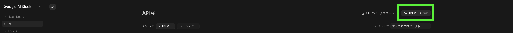
プロジェクトがない場合は作成します。
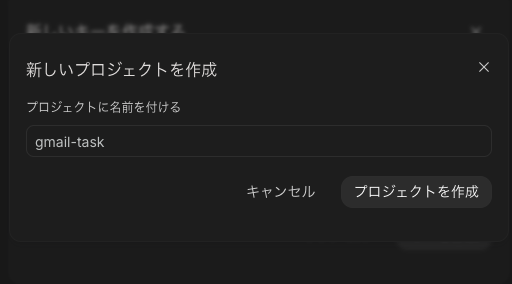
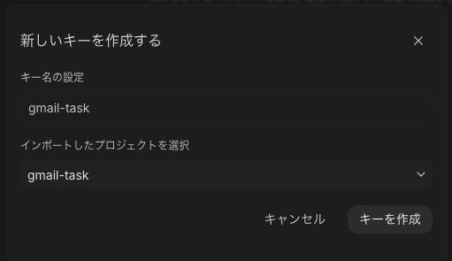
3. 表示されたAPIキーを安全な場所へ控えます。
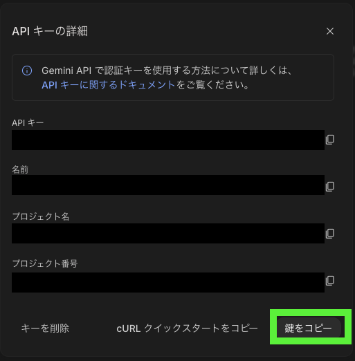

APIキーはコードへ直接書かず、後述するGASのスクリプトプロパティへ保存します。リポジトリ、チャット、スクリーンショットなどへAPIキーを含めないでください。

## 4. GASプロジェクトを作成する

1. [Google Apps Script](https://script.google.com/)を開きます。
2. 「新しいプロジェクト」を選択します。
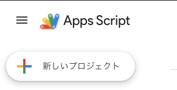
3. プロジェクト名を分かりやすい名前へ変更します。例: `Gmail TODO`
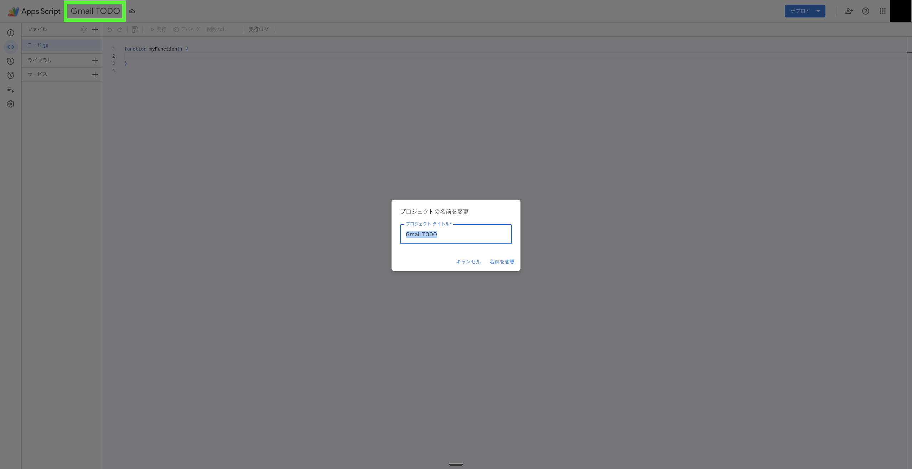

## 5. スクリプトを配置する

1. リポジトリの [`dist/gas.js`](../dist/gas.js) を開き、内容をすべてコピーします。
2. GASエディタで既存の `コード.gs` を開きます。
3. `コード.gs` の内容をすべて削除し、コピーしたコードを貼り付けます。
4. 保存します。

`src/*.js` を個別に貼り付ける必要はありません。`dist/gas.js` は必要なソースを結合した配布用ファイルです。

## 6. タイムゾーンを確認する

受信日時、Google Tasksの期限日、除外メールログ用スプレッドシートのタイムゾーンには、GASプロジェクトのタイムゾーンが使われます。

1. 左側の「プロジェクトの設定」を開きます。
2. タイムゾーンが利用地域に合っていることを確認します。
3. 日本で利用する場合は `GMT+09:00` または `Asia/Tokyo` 相当を選択します。

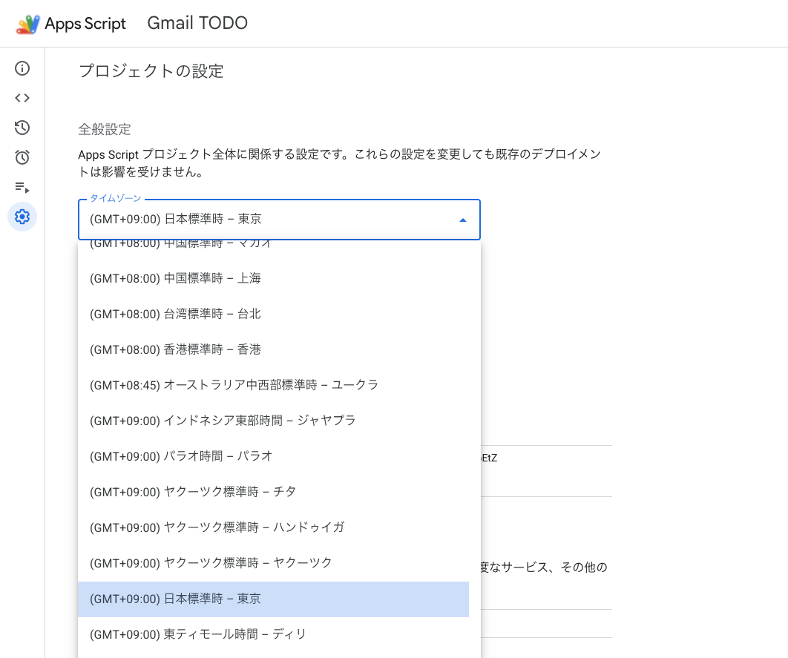

新しいGASプロジェクトはV8ランタイムを利用します。ランタイム設定が表示される場合は、V8が有効であることも確認してください。

## 7. GmailとGoogle Tasksのサービスを設定する

### 7.1 Gmailはサービス追加不要

このスクリプトは、GAS組み込みのGmailサービスである `GmailApp` を使用します。高度なGoogleサービスの「Gmail API」は使用していないため、GASエディタの「サービスを追加」からGmail APIを追加する操作は不要です。

Gmailへのアクセス権限は、手順10で `setup()` を初回実行したときに表示される権限確認画面で許可します。Apps Scriptがコード内の `GmailApp` を検出し、必要なGmail権限を自動的に要求します。

> **Google Tasks APIとの違い**
>
> Gmailは組み込みサービスの `GmailApp` を使うため追加不要です。Google Tasksは高度なGoogleサービスの `Tasks` を使うため、次の手順で明示的な追加が必要です。

### 7.2 Google Tasks APIを追加する

このスクリプトは、Apps Scriptの高度なGoogleサービスとしてGoogle Tasks APIを使用します。

1. GASエディタ左側の「エディタ」を開きます。
2. 「サービス」の右にある「サービスを追加」を選択します。
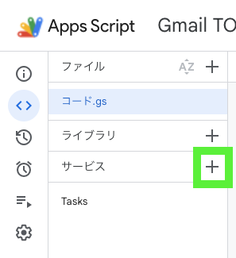
3. 一覧から「Google Tasks API」を選択します。
4. バージョンが `v1`、識別子が `Tasks` であることを確認します。
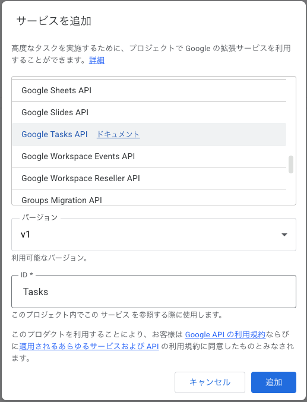
5. 「追加」を選択します。

通常のGAS既定Cloudプロジェクトでは、サービス追加時に対応APIも自動的に有効になります。標準Google Cloudプロジェクトを関連付けている場合は、Google Cloud Console側でもGoogle Tasks APIを有効にしてください。

## 8. スクリプトプロパティを設定する

1. GASエディタ左側の「プロジェクトの設定」を開きます。
2. 「スクリプト プロパティ」まで移動します。
3. 「スクリプト プロパティを追加」を選択します。
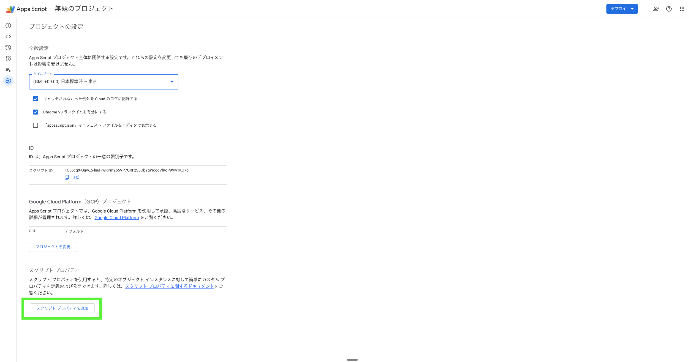
4. 次の値を入力します。

| 項目 | 値 |
|---|---|
| プロパティ | `GEMINI_API_KEY` |
| 値 | 手順3で作成したGemini APIキー |

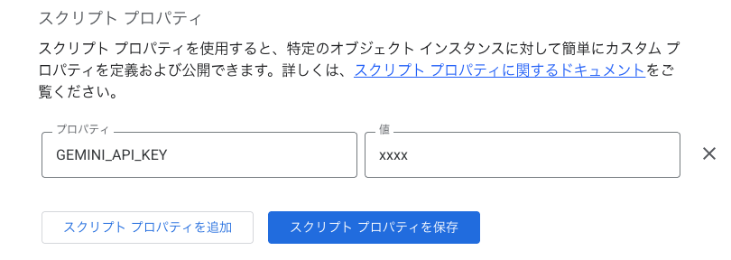

5. 「スクリプト プロパティを保存」を選択します。

`GEMINI_API_KEY` 以外の利用者向け設定は手動で追加する必要はありません。`setup()` が未設定の項目だけを初期値で追加します。

`EXCLUDED_EMAIL_SPREADSHEET_ID` も手動で追加しないでください。`setup()` が除外メールログ用スプレッドシートを作成した後、自動的に保存します。

## 9. 必要に応じて設定を変更する

初期値のまま利用する場合、この手順は不要です。初回の `setup()` 実行後に、「プロジェクトの設定」→「スクリプト プロパティ」から変更できます。コードを編集する必要はありません。

主な設定は次のとおりです。

| 設定 | 初期値 | 内容 |
|---|---:|---|
| `EXCLUDED_SUBJECT_KEYWORDS` | 複数の除外語 | 件名だけで除外するキーワード。文字列のJSON配列で指定 |
| `GMAIL_SEARCH_QUERY` | `in:inbox newer_than:2d` | Gmailの検索条件 |
| `GEMINI_MODEL` | `gemini-3.1-flash-lite` | 判定に使用するGeminiモデル |
| `TASK_LIST_TITLE` | 空文字 | 空文字の場合は最初のタスクリストを使用。指定時はGoogle Tasks上の名前と完全一致させる |
| `TASK_TITLE_PREFIX` | 空文字 | TODOタイトルの先頭に付ける文字列 |
| `INCLUDE_BODY_IN_TASK_NOTES` | `true` | TODOのメモにメール本文の抜粋を含めるか。`true` または `false` を指定 |
| `TRIGGER_INTERVAL_MINUTES` | `5` | 自動実行の間隔 |

Gemini APIを15回呼び出すと、その回の処理を正常終了します。処理済みのメールIDは保存され、未処理のメールは次回のトリガー実行時に続きから処理されます。検索結果が30スレッドを超える場合も、処理済みメールを飛ばしながら次の検索ページへ進みます。

設定を変更したら保存してください。`TRIGGER_INTERVAL_MINUTES` は `1`、`5`、`10`、`15`、`30` のいずれかを指定し、`setup()` を再実行してトリガーへ反映します。

設定をすべて初期値へ戻す場合は、GASエディタで `resetConfigProperties()` を手動実行します。`GEMINI_API_KEY` と `EXCLUDED_EMAIL_SPREADSHEET_ID` は変更されません。実行後に `setup()` を再実行し、初期値の実行間隔をトリガーへ反映してください。

## 10. `setup()` を初回実行する

1. GASエディタ上部の関数選択欄で `setup` を選択します。
2. 「実行」を選択します。
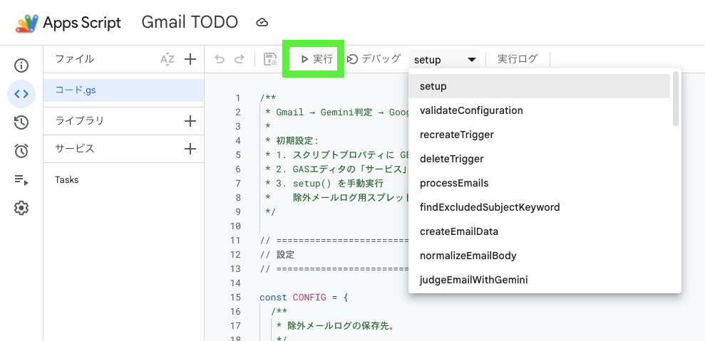
3. 権限の確認画面が表示されたら、現在のGASプロジェクトを作成したGoogleアカウントを選択します。
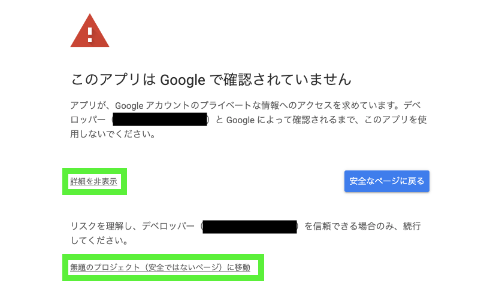
4. Gmail、Google Tasks、Google Sheets、外部サービスへの接続、トリガー管理など、表示された権限を確認して許可します。
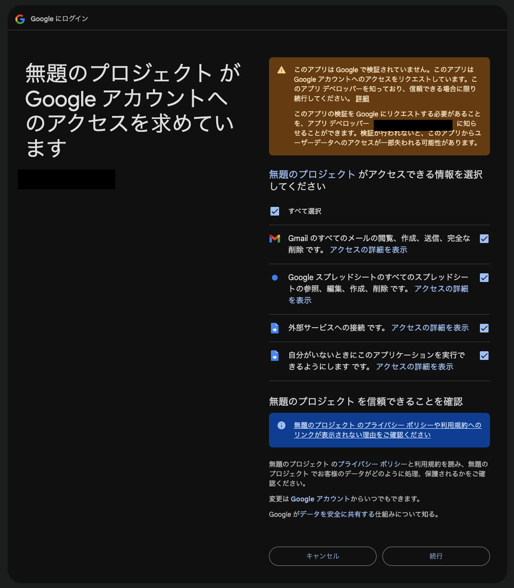

自分で作成したGASプロジェクトであることと、貼り付けたコードがこのリポジトリの `dist/gas.js` であることを確認してから許可してください。組織のGoogle Workspaceポリシーによっては、管理者の許可が必要になる場合があります。

権限許可後に処理が完了しなかった場合は、GASエディタへ戻って `setup()` をもう一度実行してください。

## 11. セットアップ完了を確認する

### 11.1 実行ログ

エディタ上部の「実行ログ」に次の内容が表示されることを確認します。

```text
除外メールログ: https://docs.google.com/spreadsheets/...
セットアップが完了しました。
5分おきに processEmails() を実行します。
```

### 11.2 除外メールログ用スプレッドシート

マイドライブに `Gmail TODO - 除外メールログ` が1つ作成されていることを確認します。

スプレッドシートでは、次の状態を確認します。

- シート名が `除外メールログ`
- 1行目が固定されている
- `受信日時`、`元メール件名`、`メール`、`除外理由` の4列が見える
- 内部的にはE列に `GmailメッセージID` があり、列が非表示になっている
- 1行目にフィルターが設定されている

### 11.3 スクリプトプロパティ

「プロジェクトの設定」→「スクリプト プロパティ」に、手順9の利用者向け設定と `EXCLUDED_EMAIL_SPREADSHEET_ID` が自動追加されていることを確認します。`EXCLUDED_EMAIL_SPREADSHEET_ID` は通常、変更や削除をしません。

### 11.4 トリガー

GASエディタ左側の「トリガー」を開き、次のトリガーが1件あることを確認します。

| 項目 | 値 |
|---|---|
| 実行する関数 | `processEmails` |
| イベントのソース | 時間主導型 |
| 実行間隔 | 5分おき |

トリガーは `setup()` を実行したGoogleアカウントの権限で動作します。

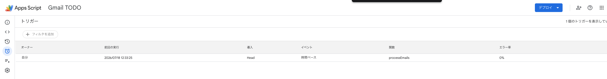

## 12. 動作確認する

通常は、トリガーによる次回実行を待てば処理が始まります。すぐに確認する場合は、GASエディタの関数選択欄から次の関数を手動実行できます。

| 関数 | 確認内容 | 副作用 |
|---|---|---|
| `testGemini` | Gemini APIへ接続できるか | API使用量が発生する |
| `testCreateTask` | Google Tasksへ登録できるか | テスト用タスクが1件作成される |
| `testAppendExcludedEmailLogs` | 除外ログの追記と重複防止 | テスト用ログが1行作成される |
| `testProcessEmails` | メール監視全体 | 検索対象メールを処理し、実際のタスクや除外ログを作成する |

`testProcessEmails` は実データを処理します。現在の `GMAIL_SEARCH_QUERY` と `MAX_THREADS_PER_RUN` を確認してから実行してください。

自動実行の結果は、GASエディタ左側の「実行数」から確認できます。失敗した実行を選ぶと、エラーメッセージとログを確認できます。

## 13. 更新・再セットアップ

コードを更新する場合は、最新の `dist/gas.js` で `コード.gs` 全体を置き換えて保存します。

設定変更や保存先の表示設定補正が必要な場合は、`setup()` を再実行できます。再実行時は次の動作になります。

- 存在する利用者向け設定は上書きせず、不足している項目だけを初期値で追加する
- 保存済みのスプレッドシートIDを再利用し、新しいスプレッドシートを増やさない
- ログ用シートの不足している表示設定を補正する
- `processEmails` の既存トリガーを削除し、設定された間隔で1件だけ作り直す

新しい権限が必要なサービスをコードへ追加した場合は、トリガー実行前に関数を手動実行して追加権限を許可してください。

## 14. 自動実行を停止・再開する

自動実行を停止する場合は、関数選択欄から `deleteTrigger` を手動実行します。

再開する場合は `setup()` を実行してください。既存の除外メールログ用スプレッドシートは再利用されます。

## 15. トラブルシューティング

### `GEMINI_API_KEYが設定されていません`

「プロジェクトの設定」→「スクリプト プロパティ」で、プロパティ名が正確に `GEMINI_API_KEY` になっているか確認します。保存後に `setup()` を再実行してください。

### `Tasks is not defined` またはGoogle Tasks関連のエラー

「サービス」にGoogle Tasks APIが追加され、識別子が `Tasks` になっているか確認します。

### Gmailへのアクセス権限に関するエラー

Gmail APIを「サービス」に追加する必要はありません。`setup()` または `testProcessEmails()` をエディタから手動実行し、Gmailへのアクセス権限を許可してください。

Google Workspaceアカウントの場合、組織の管理者がGmailへのアクセスを制限していないかも確認してください。

### 指定したタスクリストが見つからない

スクリプトプロパティの `TASK_LIST_TITLE` をGoogle Tasks上のタスクリスト名と完全一致させるか、最初のタスクリストを使用する場合は空文字に戻します。

### 除外メールログ用スプレッドシートを開けない

エラーに表示された `EXCLUDED_EMAIL_SPREADSHEET_ID` のファイルが存在し、実行アカウントに権限があるか確認します。

過去ログが不要で、新しい保存先を作ることを明示的に選ぶ場合だけ、スクリプトプロパティから `EXCLUDED_EMAIL_SPREADSHEET_ID` を削除して `setup()` を再実行します。削除済みファイルは自動復元されません。

### トリガー実行が失敗する

1. GASエディタ左側の「実行数」を開きます。
2. 失敗した `processEmails` を選択します。
3. エラー内容を確認します。
4. 権限不足の場合は `setup()` または対象のテスト関数を手動実行し、権限を再許可します。

Apps Script、Gmail、URL Fetch、Gemini APIなどには利用上限があります。短期間に大量のメールを処理する場合は、各サービスの割り当ても確認してください。

### Gemini APIのレート制限エラーが出る

`processEmails()` は1回につきGemini APIを最大15回呼び出します。ほかの処理と利用枠を共有している場合など、15回未満でもHTTP 429が返ることがあります。その場合は429になったメールを処理済みにせず、以降のAPI呼び出しを止めて次回実行時に再試行します。

最終ログでは、429になったメールが `errorCount` に1件加算され、`geminiRateLimitReached` が `true` になります。メール単位でエラーを捕捉するため、Apps Scriptの実行自体は「完了」と表示されることがあります。

## 16. 参考資料

- [スタンドアロンスクリプト](https://developers.google.com/apps-script/guides/standalone)
- [高度なGoogleサービス](https://developers.google.com/apps-script/guides/services/advanced)
- [GAS組み込みのGmailサービス（GmailApp）](https://developers.google.com/apps-script/reference/gmail/gmail-app)
- [Properties Service](https://developers.google.com/apps-script/guides/properties)
- [Googleサービスの認可](https://developers.google.com/apps-script/guides/services/authorization)
- [インストール可能なトリガー](https://developers.google.com/apps-script/guides/triggers/installable)
- [Apps Scriptのログ](https://developers.google.com/apps-script/guides/logging)
- [Gemini APIキー](https://ai.google.dev/gemini-api/docs/api-key)
